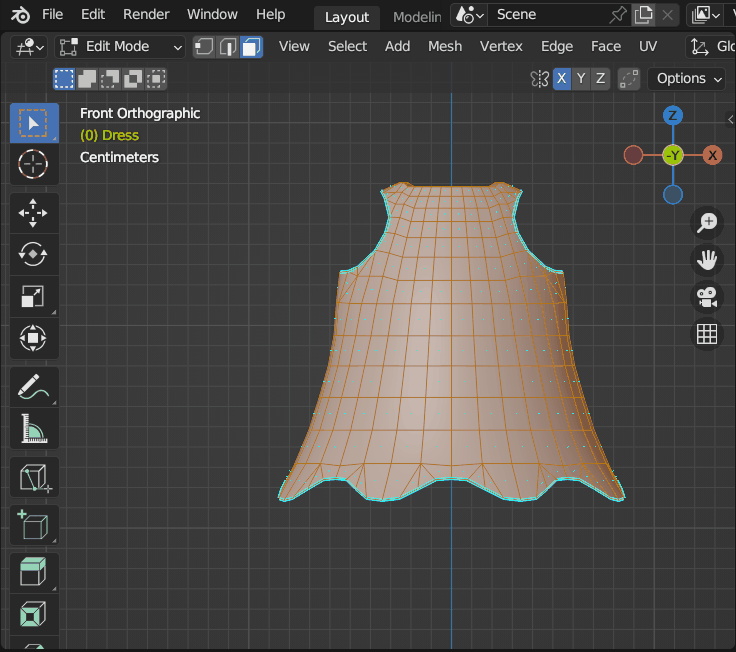

## How to cut mesh in half

* Go Edit mode
* Select all
* Press `Dot 5 1`
* Click `Bisect` (search for it F3)
* Select vertix in top center of mesh
* Drag to down vertically
* Show attributes of `Bisect` in bottom left and set all values to 0 except (Plane Normal) leave it 1, like in picture.
* Click Clean Inner we need to delete the left side of mesh (for us), It make easy when you press NumPad-3 to work on the side

## Source

https://blender.stackexchange.com/questions/208431/how-can-i-cut-a-complex-blender-object-in-half
