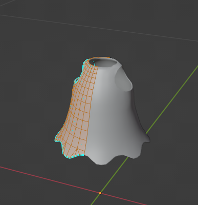
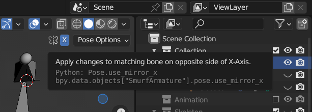
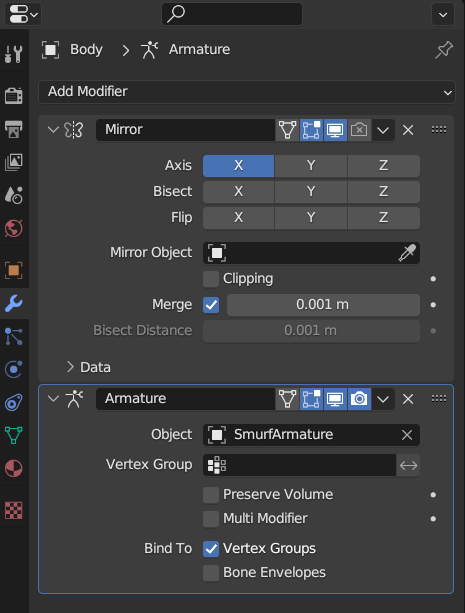
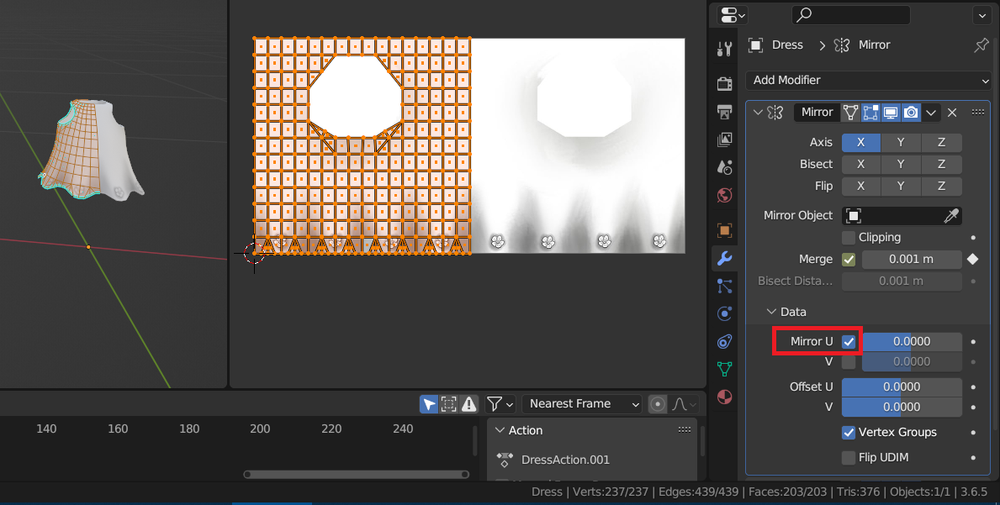
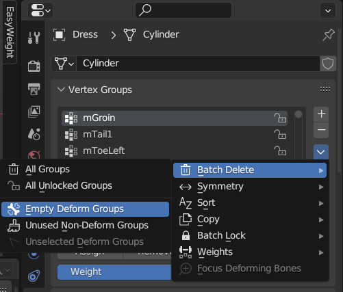
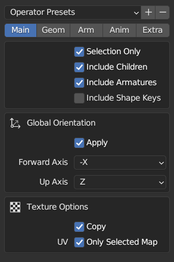

# Import and Rigging

Import the mesh you want to rig, scale and move as you like

Make your mesh faced to Y- , this help you to use mirror bones that need this direction, armature mirror works only in X axis

Apply rotations and scales (all)

## Bones

You can use it from the [SL Benot](https://wiki.secondlife.com/wiki/Project_Bento_Resources_and_Information) site or Onigiri/Bento Buddy

We provide blender file to use, it is based on original files above, try to use:

* [Female](Female_SL_Bento_Fixed.blend)

* [Male](Female_SL_Bento_Fixed.blend)

## Mirroring

After you downloaded the file to rig, or you created your own mesh, it not nessary to use mirror technic, but I prefer it if it symetric

* - Cut in half, delete the left side of mesh

* - When you are editing armature Enable X-Axies Mirror, if you want to keep same changes in both side of bones.

* - Add/Move Mirror modifier before Armature modifier using X axis

* It is really important if you mirrored your mesh, maybe you need to use full texture, included the oppsite side too, check "Mirror U" in "Mirror Modifire" -> "Data"

* - Check used groups vertices names of left side exists even if empty, both Left and Right groups must exists.

* - Remove/Delete empty vertices groups that unused, I used addon [Easy Weights](https://studio.blender.org/pipeline/addons/easy_weights) it have menu to delete all unused groups.

## Export

To export to OpenSIM, this fix the direction that opensim need it:

* - Use -X as direction, Use Z as top

## Import to OpenSIM/SL [TODO]

LOD Medium as Above if it Hair

Set other LODs (lowers) to zero

Physic Cube, Analyse

Include Joins if you want to scale the body, no need it for Hair, Clothes

## References

[Lod in FS](https://www.firestormviewer.org/lod-and-the-upcoming-firestorm-release-the-what-and-why/)
